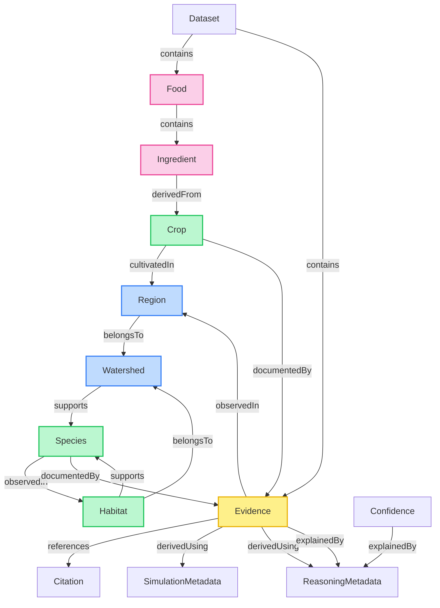
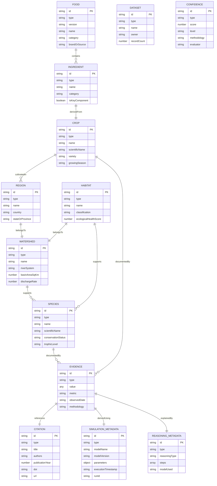

# Ripple Canonical Data Model (RCDM) - Ontology v1

Welcome to **Ripple Ontology v1**, the frozen data model and semantic structure for all environmental intelligence and supply chain datasets within the Ripple platform. 

This ontology guarantees that every dataset, whether generated by LLMs, environmental simulations, human audits, or sensors, conforms to a strict unified structure.

---

## 📐 1. System-Wide Common Fields

Every entity in RCDM v1 must implement the following base properties:

| Property | Type | Description |
|---|---|---|
| `id` | `string` | Universal Unique Identifier (UUID or URI) |
| `type` | `string` | The entity type name (discriminator matching the schema) |
| `version` | `string` | Ontology/schema version (frozen at `"1.0.0"`) |
| `confidence` | `object` | An object containing a `score` (0.0 to 1.0) and/or `level` (`'Low'`, `'Medium'`, `'High'`) or a reference `confidenceEntityId` |
| `provenance` | `object` | Ingestion lineage containing `creator`, `created` (ISO timestamp), `sourceSystem`, and `lineage` (ancestor IDs) |
| `citations` | `string[]` | Array of universal IDs pointing to `Citation` entities |
| `lastVerified` | `string` | ISO 8601 timestamp of last verification audit |
| `notes` | `string` | Optional human-readable developer or expert annotations |
| `metadata` | `object` | Extensible key-value dictionary for supplementary attributes |

---

## 🧠 2. Defined Entities

RCDM v1 contains exactly **13 core entities**:

1. **Food**: A prepared food product, recipe, or menu item.
2. **Ingredient**: A culinary component or physical ingredient of a Food item.
3. **Crop**: The botanical crop source that an ingredient is derived from.
4. **Region**: A geographic agricultural cultivation area or district.
5. **Watershed**: A catchment basin or river drainage system where agriculture is situated.
6. **Habitat**: An ecological zone or natural ecosystem supported by the watershed.
7. **Species**: Native animal, plant, insect, or keystone wildlife species in the ecosystem.
8. **Evidence**: Empirical measurements, sensor telemetry, LCA results, or observation values.
9. **Citation**: Scholarly papers, databases, or scientific publication references.
10. **Dataset**: Metadata enclosing a collection of records.
11. **Confidence**: An entity detailing deep data-quality assessments and evaluation criteria.
12. **SimulationMetadata**: Telemetry data from environmental projections or models.
13. **ReasoningMetadata**: Tracing steps from AI model reasoning or logical inferences.

---

## 🔗 3. Relationship Rules Matrix

RCDM v1 permits exactly **11 directed relationship types**. Connecting entities via relationships not defined in this matrix is a semantic violation.



### Relationship Permission Matrix

| Relationship | Allowed Source Types | Allowed Target Types |
|---|---|---|
| **`contains`** | `Food`, `Watershed`, `Dataset` | `Ingredient`, `Habitat`, Any Entity |
| **`derivedFrom`** | `Ingredient`, `Crop`, `Evidence`, `Dataset` | `Crop`, `Dataset`, `Evidence` |
| **`cultivatedIn`** | `Crop` | `Region` |
| **`belongsTo`** | `Region`, `Habitat` | `Watershed` |
| **`supports`** | `Region`, `Watershed`, `Habitat` | `Species` |
| **`observedIn`** | `Species`, `Evidence` | `Region`, `Watershed`, `Habitat` |
| **`documentedBy`**| Any Entity Type | `Evidence` |
| **`references`** | `Evidence`, `Dataset`, `Citation` | `Citation` |
| **`derivedUsing`**| `Evidence` | `SimulationMetadata`, `ReasoningMetadata` |
| **`simulatedBy`** | `Evidence`, `SimulationMetadata` | `SimulationMetadata` |
| **`explainedBy`** | `Evidence`, `Confidence` | `ReasoningMetadata` |

---

## 📊 4. Entity Relationship Diagram (ERD)



---

## 🛠️ 5. Validation Architecture

RCDM enforces a two-tier validation approach:

1. **Structural Validation (JSON Schema)**: Ensures required fields are present, types are correct (e.g. coordinates are numbers, dates are string-formatted dates), and values adhere to boundaries.
2. **Semantic Validation (Relationship Matrix)**: Validates directed edge rules, matching target nodes, and custom field boundaries (e.g., confidence scores $\in [0.0, 1.0]$).

### Importing validation utility:

```typescript
import { validateEntity, validateRelationship, validateGraph } from './validationUtils';

// Validate a single entity
const report = validateEntity(myEntityObject);
if (!report.isValid) {
  console.error("Entity Errors:", report.errors);
}

// Validate a whole graph
const graphReport = validateGraph(nodes, edges);
if (!graphReport.isValid) {
  console.error("Graph Structural/Semantic Violations:", graphReport.structuralErrors);
}
```
